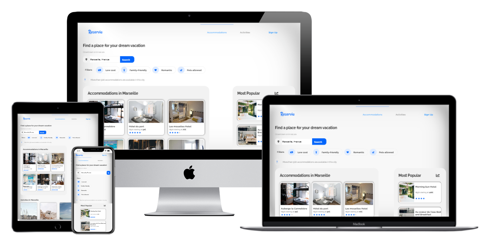

# Open Classrooms - P2 - Reservia
*Transform mockup into responsive one-page HTML/CSS static template*

[My web page hosted online on GitHub Pages](https://seanedwards2021.github.io/P2-Reservia/)

## Technologies i used for this project
- HTML5 Semantic Tags
- CSS3 Flexbox
- CSS3 Custom Media Queries
